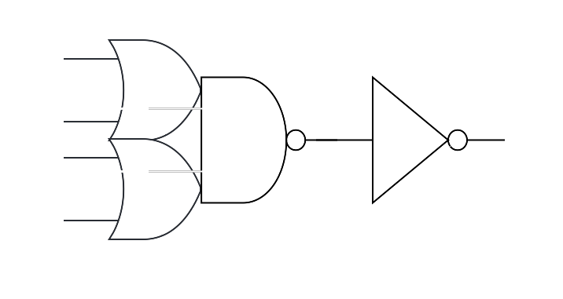
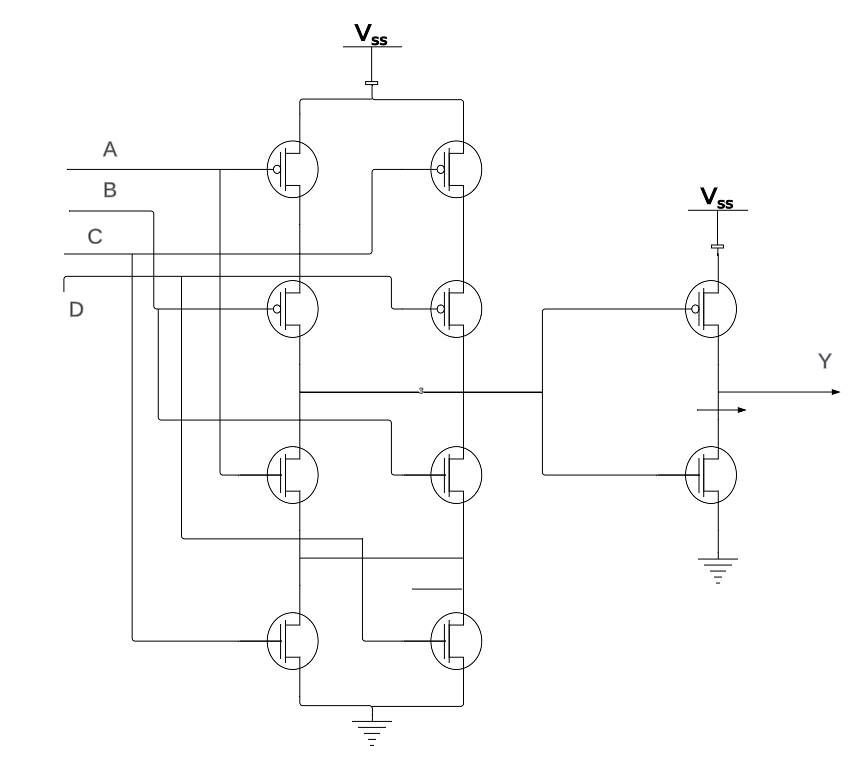
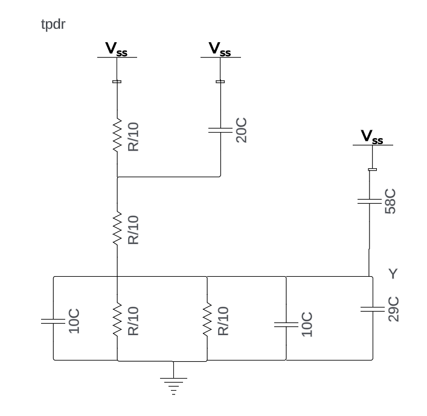

# Tarea-2 Introducción al diseño de circuitos integrados

# Teoría
## Compuertas simples
## Compuerta compleja
Usando la función lógica base, se puede obtener la compuerta compleja or-or-and-invert + invert mostrada a continuación.

El cual se vería de la siguiente forma a nivel de transistores.

Luego se obtuvo el esfuerzo lógico de la compuerta y el retardo.

$$H = 500/30 = 16.7 $$
$$G = 6/3 = 2$$
$$D = 2*16.7+5 = 38.4\tau$$

Además, se calculó el tamaño de las compuertas necesarias para cumplir con las especifiaciones.

$$z= \frac{500*1}{5.779} = 86.52\lambda$$
$$x= \frac{86.52*2}{5.779} = 30\lambda$$

A continuación, es necesario calcular los tiempos de retardo mediante la aproximación de Elmore.

tpdr

## Simulación
### Compuertas simples
### Compuerta compleja
