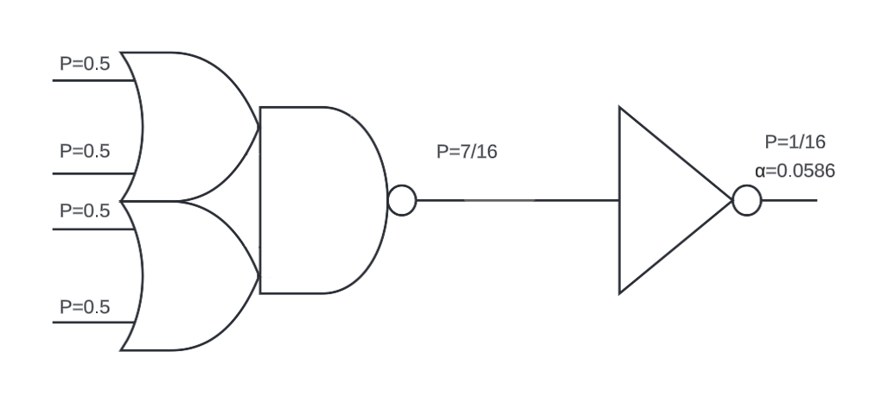

# Tarea-2 Introducción al diseño de circuitos integrados

Esteicy Jazmín Faerron Durán
Andrew José Quirós Rodríguez

# Teoría

En este informe se plantean dos diseños estáticos de CMOS para la siguiente función lógica: 

F= (A+B)(C+D)

En donde uno de los diseños consta de compuertas simples y el otro diseño será con compuerta compleja.
Por otra parte, se solicita que el tamaño máximo de cada entrada sea de 30 $\lambda$ y que la salida debe ser de 500 $\lambda$. [1]

## Compuertas simples

### Definición de compuertas

Para poder definir cuáles compuertas se van a utilizar se debe tomar en cuenta que se utiliza la lógica invertida, y así es como resulta el diseño:


### Definición de tamaño de compuertas

Para definir el tamaño de las compuertas se procede con los cálculos de las siguientes ecuaciones:

$F=GH = \dfrac{5}{3}\cdot\dfrac{5}{3}\cdot\dfrac{500}{30} = 46.296$

$f=F^{1/2} = \sqrt{46.296}=6.804$

Para la segunda compuerta de la derecha:

$C_{in}=\dfrac{C_{out}\cdot g_{i}}{f}$

$y=\dfrac{500\cdot\frac{5}{3}}{6.804}=122.47$

Para cualquiera de las compuertas de la izquierda

$x=\dfrac{122.47\cdot\dfrac{5}{3}}{6.804}=30$

Y así se vería el circuito con el tamaño de cada compuerta:


### Definición del tamaño de los transistores

Como una NOR debe tener un tamaño de 4 en PMOS y de 1 en el NMOS para un total de 5 de entrada, entonces la distribución ahora será la misma pero la suma de ambas debe dar 30 en el caso de las compuertas de la izquierda y 122 para la compuerta de la derecha, dando como resultado:


### Diseño del esquemático

Como cada compuerta NOR está separada, solo se requiere del diseño de una NOR de 2 entradas y los tamaños cambian, así queda de la siguiente manera:


### Tiempos de retardo

Con la aproximación de Elmore se obtienen los retardos que se muestran a continuación:

1. Compuerta NOR de 30

Rise


$tpdr=\dfrac{R}{12}\cdot 24C + \dfrac{2R}{12}\cdot 36C = 8\tau$

$tcdr=\dfrac{2R}{12}\cdot 26C = \dfrac{13}{3}\tau$

Fall


$tpdf=\dfrac{R}{6}\cdot 26C=\dfrac{13}{3}\tau$

$tcdf=\dfrac{13}{6}\tau$

2. Compuerta NOR de 122

Rise


$tpdr=\dfrac{R}{49}\cdot 98 + \dfrac{2R}{49}\cdot 147C = 8\tau$

$tcdr=\dfrac{2R}{49}\cdot 147C = 6\tau$

Fall


$tpdf=\dfrac{R}{6}\cdot 147C= \dfrac{49}{2}\tau$

$tcdf=\dfrac{49}{4}\tau$

Ahora sumando todos los tiempos para obtener los finales:

$t_{pdr}=8\tau+8\tau=16\tau$

$t_{cpr}=\dfrac{13\tau}{3}+6\tau=\dfrac{31}{3}\tau$

$t_{pdf}=\dfrac{13}{3}\tau+\dfrac{49}{2}\tau=\dfrac{173}{6}\tau$

$t_{cdf}=6\tau+\dfrac{49}{4}\tau=\dfrac{73}{4}\tau$

### Potencia dinámica

Para el cálculo de la potencia dinámica se utiliza la siguiente ecuación:

$P_{switching}=\alpha CV_{DD}^{2}f$

Para poder averiguar su valor primero hay que averiguar cada parámetro. A continuación se muestra el cálculo de cada uno:

1. Factor de actividad ($\alpha$)

Este se calcula mediante las probabilidades, en la siguiente figura se muestran los valores calculados para las compuertas simples:


2. Frecuencia mínima

Para calcular el tiempo de retardo se utiliza el $\tau=2.87\times10^{-12}$ (calculado de la tarea anterior) y con los tiempos de retardo de propagación calculados anteriormente, entonces queda de la siguiente manera:

$t_{pdr}=16\tau= 4.592\times^{-11}s$

$t_{pdf}=\dfrac{173}{6}\tau= 82.75\times^{-12}s$

$t_{min}=128.67\times10{-12}s$

Con este tiempo mínimo se calcula la frecuencia máxima como:

$f_{max}=7.77GHz$

3. Potencia dinámica

Ya con los parámetros calculados se puede calcular la potencia dinámica de la compuerta simple:

$P_{switching}=0.246\cdot500\cdot0.487fF\cdot1.8^{2}\cdot7.776GHz=1.51mW$

## Compuerta compleja

### Definición de compuertas

Usando la función lógica base, se puede obtener la compuerta compleja or-or-and-invert + invert mostrada a continuación.


### Definición de tamaño de compuertas

Con este circuito se calcula el esfuerzo lógico de la compuerta y el retardo.

$$H = 500/30 = 16.7 $$
$$G = 6/3 = 2$$
$$D = 2*16.7+5 = 38.4\tau$$

Y el tamaño de las compuertas necesarias para cumplir con las especifiaciones:

$$z= \frac{500*1}{5.779} = 86.52\lambda$$

$$x= \frac{86.52*2}{5.779} = 30\lambda$$

Dando como resultado la siguiente figura del circuito con sus respectivos tamaños:


### Definición del tamaño de los transistores

El circuito lógico anterior a nivel de transistores se muestra a continuación con sus respectivos tamaños calculados:


### Tiempos de retardo de Elmore

A continuación, es necesario calcular los tiempos de retardo mediante la aproximación de Elmore.


$tpdr=(\dfrac{R}{10})(20C)+(\dfrac{2R}{147C}) = 31.4\tau$


$tcdr=\dfrac{147}{2}\tau$


$tpdf= (\dfrac{R}{10})(10C) + (\dfrac{2R}{10})(147C) = 30.4\tau$


$tcdf=\dfrac{147}{2}\tau$

### Potencia dinámica

1. Factor de actividad



2. Frecuencia mínima

$t_{pdr}=31.4\tau=90.118ps$

$t_{pdf}=30.4\tau=87.248ps$

$t_{min}=177.366ps$

$f_{max}=5.638GHz$

3. Potencia dinámica

$P_{switching}=0.0586\cdot500\cdot0.487fF\cdot1.8^{2}\cdot5.638GHz=0.261mW$

# Simulación

## Compuertas simples

### Esquemático 

Para el tamaño de las compuertas, solo se multiplica los tamaños mínimos de los transistores (NMOS de 220n y PMOS de 440n) por los tamaños que se calcularon. Y resulta el siguiente esquemático en simulación:

[Compuerta de 30](archivos/nor2x1_24_6/schematic/)


[Compuerta de 122](archivos/nor2x1_98_24/schematic/)


Una vez teniendo las compuertas creadas en esquematico, se procede a armar el [circuito de compuertas completo](archivos/SimpleDesign/schematic/), como se muestra en la siguiente figura:


### Tiempos de retardo

Con diferentes entradas de estímulo se obtienen los siguientes tiempos de retardo de propagación y de contaminación:

$t_{pdr}$


$t_{pdf}$


$t_{cdr}$


$t_{cdf}$


Con estos tiempos se puede comparar la diferencia con los que se calcularon en la teoría en la siguiente tabla se muestra dicha comparación:

|Tiempo|Teórico (ps)|Simulado (ps)|Simulado/Teórico [ps]|
|--|--|--|--|
|$t_{pdr}$|45.92|156|3.39|
|$t_{pdf}$|82.75|235|2.83|
|$t_{cdr}$|29.65|147|4.95|
|$t_{cdf}$|52.37|190|3.62|

Como se puede observar en la tabla, los resultados de la simulación son muy distintos a los calculados en la teoría, por lo que no se puede basar solo en el esfuerzo lógico para calcular dichos tiempos a nivel teórico.

### Caminos de Euler y diagrama de palitos

Para un circuito de compuertas simples, no es necesario hacer un análisis de caminos de Euler, debido a que cada cada compuerta en individual, por otro lado, para el diagrama de palitos se muestra el de una compuerta NOR, como está compuesto de 3 NOR el circuito simple, cada compuerta utiliza uno igual para cada una. Este se muestra a continuación:


### Layout de compuerta
El [layout](archivos/nor2/layout/) de la compuerta NOR se muestra en la siguiente figura:


Y el layout después de pasar todas las verificaciones:


### Tiempos de retardo con capacitancias parásitas

Estos tiempos son los resultados de la medición después de realizar el layout del circuito:

|Retardo|Contaminación (ps)|Propagación (ps)|
|--|--|--|
|rise|232|285|
|fall|247|283|

### Comparación de tiempos

En base a los resultados obtenidos de la simulación antes y después del trazado, se obtiene la siguente tabla comparativa:

|Tiempo|Sin parasitas (ps)|Con parasitas (ps)|con parasitas/sin parasitas [ps]|
|--|--|--|--|
|$t_{pdr}$|156|285|1.8|
|$t_{pdf}$|235|283|1.2|
|$t_{cdr}$|147|232|1.5|
|$t_{cdf}$|190|247|1.3|

En estos resultados se puede observar la gran diferencia entre ambos, demostrando que con capacitancias parásitas aumenta el tiempo de manera significativa, hasta llegar a casi el doble en el caso de $t_{pdr}$.

### Potencia

Para la simulación, la potencia se saca con el siguiente [script](archivos/nor2/nor2):

```
*  Generated for: FineSimProVCS
*  Design library name: basic_cells
*  Design cell name: test_nor
*  Design view name: config

.option finesim_output=fsdb finesim_merge_fsdb=1


.temp 25
.lib '/mnt/vol_NFS_rh003/Est_VLSI_I_2024/Quiros_Rodriguez_I_2024_vlsi/tutorial/Hspice/lp5mos/xt018.lib' tm
.lib '/mnt/vol_NFS_rh003/Est_VLSI_I_2024/Quiros_Rodriguez_I_2024_vlsi/tutorial/Hspice/lp5mos/param.lib' 3s
.lib '/mnt/vol_NFS_rh003/Est_VLSI_I_2024/Quiros_Rodriguez_I_2024_vlsi/tutorial/Hspice/lp5mos/config.lib' default

.global gnd vdd_
********************************************************************************
* Library          : basic_cells
* Cell             : nor2
* View             : starrc_C
* View Search List : schematic hspice symbol
* View Stop List   : symbol
********************************************************************************
.subckt nor2 a b q
cg5_3 b gnd  c=3.83766e-16
c5_2 b a  c=9.59565e-17
c5_1 b q  c=2.1963e-16
cg4_2 a gnd  c=3.82853e-16
c4_1 a q  c=2.50425e-16
cg1_1 q gnd  c=1.73354e-16
x2 q a gnd gnd ne w=0.42u l=0.21u as=0.7104p ad=0.1134p ps=4.14u pd=0.96u nrs=-1
+ nrd=-1 m='1*1' par1='1*1' xf_subext=0
x1 q b gnd gnd ne w=0.42u l=0.21u as=0.7104p ad=0.1134p ps=4.14u pd=0.96u nrs=-1
+ nrd=-1 m='1*1' par1='1*1' xf_subext=0
x5 n_7 a q vdd_ pe w=0.72u l=0.21u as=0.3456p ad=0.09p ps=2.4u pd=0.97u nrs=-1
+ nrd=-1 m='1*1' par1='1*1' xf_subext=0
x4 vdd_ b n_7 vdd_ pe w=0.72u l=0.21u as=0.09p ad=1.168p ps=0.97u pd=4.9u nrs=-1
+ nrd=-1 m='1*1' par1='1*1' xf_subext=0
.ends nor2

********************************************************************************
* Library          : basic_cells
* Cell             : test_nor
* View             : schematic
* View Search List : schematic hspice symbol
* View Stop List   : symbol
********************************************************************************
v28 d gnd dc=0 pulse ( 0 1.8 0 100p 100p 0.3n 0.8n )
v27 c gnd dc=0 pulse ( 0 1.8 0 100p 100p 0.3n 0.8n )
v26 b gnd dc=0 pulse ( 0 1.8 0 100p 100p 0.3n 0.8n )
v24 a gnd dc=0 pulse ( 0 1.8 0 100p 100p 0.3n 0.8n )
xi7 a b net42 nor2
xi9 net42 net43 out nor2
xi8 c d net43 nor2
c10 out gnd c=5f
v12 vdd_ gnd dc=1.8


.tran 10p 15n

.option PARHIER = LOCAL
.option finesim_mode = spicead
.option s_elem_cache_dir = "/home/Quiros_Rodriguez_I_2024_vlsi/.synopsys_custom/sparam_dir"
.option pva_output_dir = "/home/Quiros_Rodriguez_I_2024_vlsi/.synopsys_custom/pva_dir"

.print P(v12)
.measure pwr AVG P(v12) FROM=0ns TO=10ns


.end
```

De esta forma se obtiene en este caso que la pontencia es:

$Potencia = 413.7\mu W = 0.413mW$

## Compuerta compleja

### Esquemático 

Para el circuito complejo el [esquemático](archivos/complex/schematic/) en simulación queda de la siguiente forma:


### Tiempos de retardo

|Tiempo de retardo|Contaminación (ps)|Progración (ps)|
|--|--|--|
|rise|82.9|93.9|
|fall|107|136|

En comparación con los tiempos calculados en la parte teórica se muestra la siguiente tabla comparativa:

|Tiempo|Teórico (ps)|Simulado (ps)|Simulado/Teórico [ps]|
|--|--|--|--|
|$t_{pdr}$|90.118|93.9|1.04|
|$t_{pdf}$|87.248|136|1.55|
|$t_{cdr}$|210|82.9|0.39|
|$t_{cdf}$|210|107|0.5|

### Caminos de Euler y diagrama de palitos

Para los caminos de Euler se tienen los de Pull Up y Pull Down como se muestra a continuación:

|Pull Up|Pull Down|
|--|--|
|||

De lo anterior se obtiene que el orden de las conexiones en el diagrama de palitos son D-C-A-B.


### Layout de compuerta
A continuación se muestra como queda el circuito en simulación del [layout](archivos/complex/layout/):


Y así se muestra cuando pasa por todas las verificaciones de la simulación:


### Tiempos de retardo con capacitancias parásitas

|Tiempo de retardo|Contaminación (ps)|Progración (ps)|
|--|--|--|
|rise|149|194|
|fall|170|186|

### Comparación de tiempos

En base a los resultados obtenidos de la simulación antes y después del trazado, se obtiene la siguente tabla comparativa:

|Tiempo|Sin parasitas (ps)|Con parasitas (ps)|con parásitas/sin parásitas [ps]|
|--|--|--|--|
|$t_{pdr}$|93.9|194|2.06|
|$t_{pdf}$|136|186|1.36|
|$t_{cdr}$|82.9|149|1.79|
|$t_{cdf}$|107|170|1.58|

En este caso al igual que en el circuito de compuertas simples, se puede observar que el tiempo aumenta con capacitancias parásitas, en donde en este sí llega a ser el doble en el caso del $t_{pdr}$.

### Potencia

Para la potencia de este circuito en la simulación se obtiene con el siguiente [script](archivos/test_complex_mixta/simu_complex.spp):

```
*  Generated for: FineSimProVCS
*  Design library name: basic_cells
*  Design cell name: test_complex_mixta
*  Design view name: config

.option finesim_output=fsdb finesim_merge_fsdb=1


.temp 25
.lib '/mnt/vol_NFS_rh003/Est_VLSI_I_2024/Quiros_Rodriguez_I_2024_vlsi/tutorial/Hspice/lp5mos/xt018.lib' tm
.lib '/mnt/vol_NFS_rh003/Est_VLSI_I_2024/Quiros_Rodriguez_I_2024_vlsi/tutorial/Hspice/lp5mos/param.lib' 3s
.lib '/mnt/vol_NFS_rh003/Est_VLSI_I_2024/Quiros_Rodriguez_I_2024_vlsi/tutorial/Hspice/lp5mos/config.lib' default

.global gnd vdd_
********************************************************************************
* Library          : basic_cells
* Cell             : complex
* View             : starrc_C_RC
* View Search List : schematic veriloga hspice symbol
* View Stop List   : symbol
********************************************************************************
.subckt complex a b c d q
cg11_5 n_4 gnd  c=7.53873e-16
c11_4 n_4 b  c=3.36153e-16
c11_3 n_4 a  c=1.46419e-16
c11_2 n_4 c  c=7.68275e-17
c11_1 n_4 q  c=2.20802e-16
cg7_2 b gnd  c=3.00695e-16
c7_1 b a  c=2.27903e-16
cg6_2 a gnd  c=2.95879e-16
c6_1 a c  c=1.94455e-16
cg5_2 c gnd  c=3.3874e-16
c5_1 c d  c=1.34912e-16
cg4_1 d gnd  c=5.06874e-16
cg3_1 q gnd  c=1.993e-16
x5 gnd d n_6 gnd ne w=0.42u l=0.21u as=0.3429p ad=0.1134p ps=2.92u pd=0.96u nrs=-1
+ nrd=-1 m='1*1' par1='1*1' xf_subext=0
x4 gnd c n_6 gnd ne w=0.42u l=0.21u as=0.3429p ad=0.1134p ps=2.92u pd=0.96u nrs=-1
+ nrd=-1 m='1*1' par1='1*1' xf_subext=0
x3 n_4 a n_6 gnd ne w=0.42u l=0.21u as=0.3429p ad=0.1134p ps=2.92u pd=0.96u nrs=-1
+ nrd=-1 m='1*1' par1='1*1' xf_subext=0
x2 n_4 b n_6 gnd ne w=0.42u l=0.21u as=0.3429p ad=0.1134p ps=2.92u pd=0.96u nrs=-1
+ nrd=-1 m='1*1' par1='1*1' xf_subext=0
x1 q n_4 gnd gnd ne w=0.42u l=0.21u as=0.2912p ad=0.2016p ps=2.21u pd=1.8u nrs=-1
+ nrd=-1 m='1*1' par1='1*1' xf_subext=0
x9 n_12 a n_4 vdd_ pe w=0.72u l=0.21u as=0.21015p ad=0.09p ps=1.365u pd=0.97u
+ nrs=-1 nrd=-1 m='1*1' par1='1*1' xf_subext=0
x8 vdd_ b n_12 vdd_ pe w=0.72u l=0.21u as=0.09p ad=0.677737p ps=0.97u pd=2.58u
+ nrs=-1 nrd=-1 m='1*1' par1='1*1' xf_subext=0
x7 q n_4 vdd_ vdd_ pe w=0.72u l=0.21u as=0.677737p ad=0.3456p ps=2.58u pd=2.4u
+ nrs=-1 nrd=-1 m='1*1' par1='1*1' xf_subext=0
x11 n_11 d vdd_ vdd_ pe w=0.72u l=0.21u as=0.7482p ad=0.09p ps=4.26u pd=0.97u
+ nrs=-1 nrd=-1 m='1*1' par1='1*1' xf_subext=0
x10 n_4 c n_11 vdd_ pe w=0.72u l=0.21u as=0.09p ad=0.21015p ps=0.97u pd=1.365u
+ nrs=-1 nrd=-1 m='1*1' par1='1*1' xf_subext=0
.ends complex

********************************************************************************
* Library          : basic_cells
* Cell             : test_complex_mixta
* View             : schematic
* View Search List : schematic veriloga hspice symbol
* View Stop List   : symbol
********************************************************************************
xi0 a b c d out complex
v20 d gnd dc=0 pulse ( 0 1.8 0 100p 100p 0.3n 0.8n )
v19 c gnd dc=0 pulse ( 0 1.8 0 100p 100p 0.3n 0.8n )
v18 b gnd dc=0 pulse ( 0 1.8 0 100p 100p 0.3n 0.8n )
v7 a gnd dc=0 pulse ( 0 1.8 0 100p 100p 0.3n 0.8n )
v5 vdd_ gnd dc=1.8
c6 out gnd c=5f


.tran 10p 15n

.option PARHIER = LOCAL
.option finesim_mode = spicead
.option s_elem_cache_dir = "/home/Quiros_Rodriguez_I_2024_vlsi/.synopsys_custom/sparam_dir"
.option pva_output_dir = "/home/Quiros_Rodriguez_I_2024_vlsi/.synopsys_custom/pva_dir"

.print P(v5)
.measure pwr AVG P(v5) FROM=0ns TO=15ns


.end
```

De este script se obtiene el siguiente resultado:

$Potencia = 71.3792\mu W  = 0.07138mW$

# Bilbiografía
[1] N. Weste and D. Harris, CMOS VLSI Design: A Circuits and Systems Perspective, 4 edition. Boston: 
Addison-Wesley, 2010.
